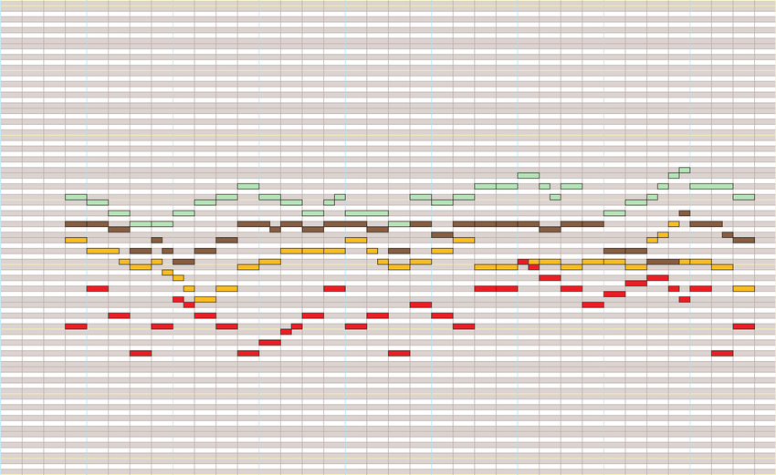

# Music Generation with Stacked Decoder Transformers

## Project Outline
Many types of data are “recurrent” in nature, meaning that the data is sequential and that individual data at future time steps could somewhat depend on previous time steps. An increasingly popular example of this is with natural language: one word after the other. Words are placed sequentially, and each successive word depends on the context of words that come before it – continuously randomly sampling words from a vocabulary bank to generate text would not yield something very cohesive. In essence, to generate text, we first need a way to model the intricate the relationship between the words in a larger body of text so we can sequentially place them in an order that makes sense. Much is the same for music! Cohesive music pieces have structure, rhythm, harmonies, sensible key changes that cannot simply be modeled through randomness. Music does not gain its meaning from its individual notes, rather the movement of the piece from one note to the next. Similar to how Recurrent Neural Networks, Long-Short-Term-Memory networks, the Transformer architecture have shown to be great at modeling relationships between sequential data like text, I propose they can also be great at modelling the intricate and nuanced relationships between musical notes in a composition.

The primary premise of this project is to train a large Decoder-only based Transformer, much like GPT, but on music notes from MIDI files to attempt to generate coherent, interesting, developed piano compositions much like current state-of-the-art language models, like ChatGPT, produce seemingly realistic, high quality stories.

## Project Goals
1. Learn to build, from the bottom up, various Neural Network architecture types such as RNN’s, LSTM’s, or Transformers using native PyTorch
2. Train these models to generate coherent Piano compositions
3. Compare and contrast the various models for music generation.
4. Deploy the service on a scalable webapp using a cloud-hosting platform

